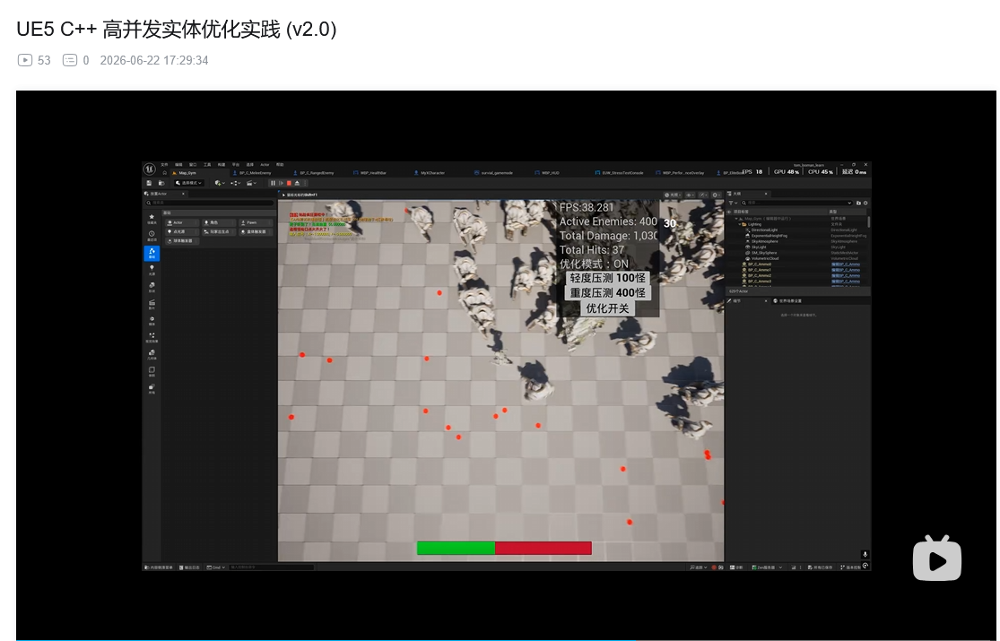
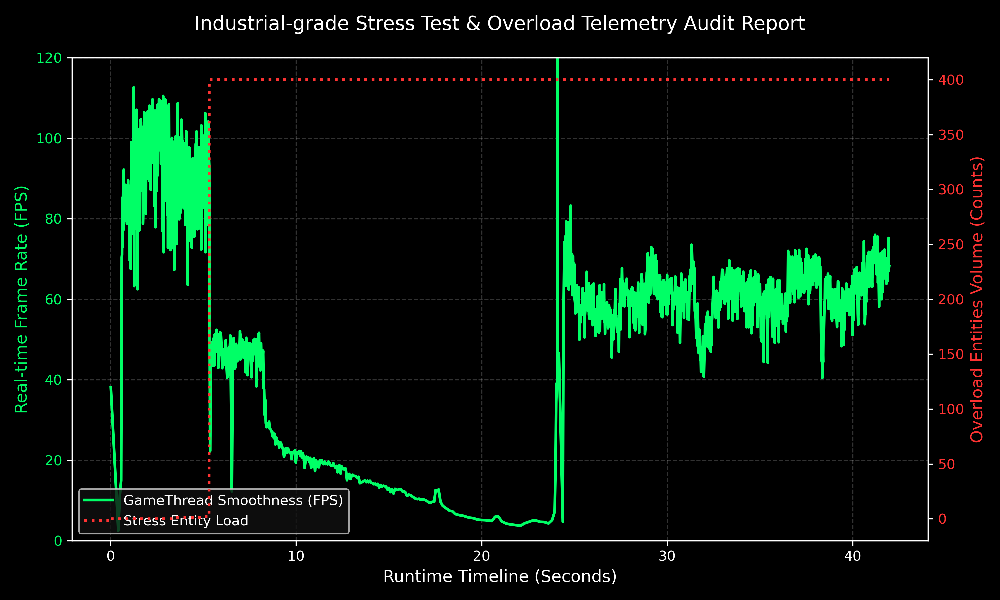
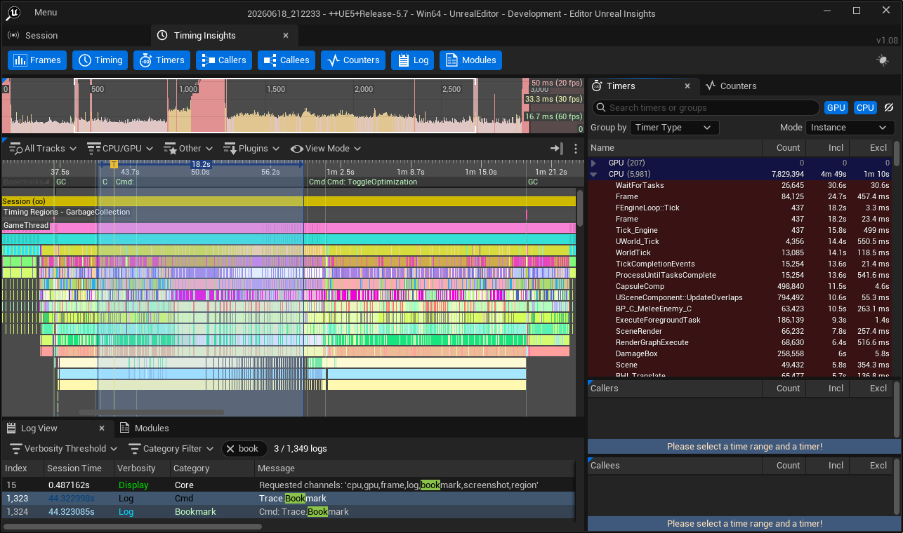

# UE5 C++ High-Concurrency Entity Stress Optimizer
**基于 Unreal Engine 5 的海量骨骼蒙皮实体性能优化与调度框架 (v2.0)**

## 📊 Quick Demo View
* **测试场景**：同屏 400 具完整骨骼蒙皮 NPC 极限战斗压测
* **优化前 (Base Line)**：~8 FPS (伴随明显的主回路延迟)
* **一键开启优化后 (Optimized)**：45-50 FPS (运行稳定)
* **性能提升 (Improvement)**：约 **5x - 6x** 帧率提升
* **单帧逻辑处理延迟**：稳定控制在 **15.6ms** 以内
* 
🎥 **压测实录视频**: 
[点击观看 Bilibili 压测数据与表现演示](https://www.bilibili.com/video/BV1Jx7K6hEW7/)


## 📌 项目简介
本项目针对 UE5 海量骨骼蒙皮实体（400+）同屏场景下 Tick 调度压力、碰撞交互开销以及对象频繁创建销毁带来的性能波动问题，设计了一套基于 C++ 的实体调度与性能优化框架。
项目完成了近战接触、远程射线检测、动画状态流的解耦与性能并网，在受限硬件下实现了帧率与运算延迟的稳定控制。

## 🚀 核心优化策略

### 1. 内存防线：全局拦截式对象池 (Object Pool Manager)
针对高频实体生成与销毁引发的 GC 卡顿，实现 `AActor` 级别的池化复用管理。
* **策略**：替代高频实体 Destroy 流程，引入对象池回收机制 (Recycle)。
* **实现**：拆分敌人与射弹对象池。在对象入池前，执行严格的状态重置（清空物理线速度、重置碰撞通道、清理绑定定时器），规避野指针与状态残留。

### 2. 物理开销裁剪：碰撞矩阵重构与交互降维
针对大量实体互相挤压（Depenetration）引发的物理线程过载进行运行时裁剪。
* **策略**：动态重构 Collision Profile，在优化状态下将同类实体交互规则降维为 `Ignore`。
* **实现**：运行时调用 `SetGenerateOverlapEvents(false)` 物理断流群体重叠事件生成。仅保留对射弹 (Ammo) 通道的精确阻挡 (`Block`)，在确保受击业务正常运作的前提下，减少无效实体间碰撞查询与事件回调开销。

### 3. 逻辑调度：Tick 降频分派与表现层解耦
* **Tick Jitter 调度**：引入随机相位步长，为实体分配 `0.030s ~ 0.036s` 的离散 Tick 间隔，平摊主线程 CPU 时间片，打散逻辑共振。
* **动画状态流控制**：减少 AnimBlueprint 高频状态更新开销。通过 C++ 运行时直接操控骨骼网格体组件 (`PlayAnimation` / `Stop`) 进行按需动画播放，并结合 `SetPlayRate` 配平移动步幅。
* **业务解耦**：近战判定回退至低开销的几何距离轮询；远程逻辑通过 `GetSocketLocation` 动态抓取枪口骨骼槽位，结合对象池执行无阻塞射击。

## 📊 性能遥测与压测数据 (Benchmark)
内嵌轻量级性能探针 (`PerformanceTracker`)，支持 CSV 数据导出与 Unreal Insights 指标对比。

### 1. 实时吞吐量与帧率动态变化曲线
利用探针异步导出的遥测数据生成以下图表。可以观察到，在未开启优化的基准测试态下，同屏实体达到 400 规模时帧率降至约 8 FPS；在第 24 秒开启框架调度后，主线程帧率迅速回升并稳定在 45-50 FPS 区间。



### 2. 底层性能剖析 (Unreal Insights Flame Graph)
通过 Unreal Insights 进行耗时对账，精准排查 `GameThread` 耗时瓶颈，验证碰撞过滤 (`Collision Filtering`) 与重叠事件切断后底层物理开销的实际裁剪效果。




---

## 💻 测试环境 (Hardware Benchmark)
* **硬件环境 (PC)**：
  * **CPU**: Intel(R) Core(TM) i5-14400F (2.50 GHz)
  * **GPU**: NVIDIA GeForce RTX 4060 Ti (8 GB)
  * **RAM**: 32.0 GB
* **硬件环境 (边缘端系统对账)**：NVIDIA Jetson Orin Nano
* **运行工况**：同屏 400 具高面数完整骨骼蒙皮实体，全量开启开火特效、受击反馈、碰撞矩阵重构与对象池循环回收流程。

---

* ## 📁 目录结构 (Project Structure)
```text
Source/tom_looman_learn/
 ├── Public/ & Private/
 │    ├── EnemyPoolManager      # 内存级敌人对象池核心管理类
 │    ├── BulletPoolManager     # 射弹资源复用核心管理类
 │    ├── SurvivalGameMode      # 全局调度核心，统筹波次逻辑与碰撞矩阵重构
 │    ├── MyTarget              # 多态战斗实体基类，封装表现层解耦机制
 │    ├── MeleeEnemy            # 近战派生类，封装几何距离撕咬逻辑
 │    ├── RangedEnemy           # 远程派生类，封装 Socket 槽位开火业务
 │    └── MyPerformanceTracker  # 轻量级性能采样探针与监控模块
